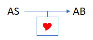
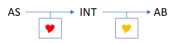
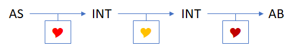
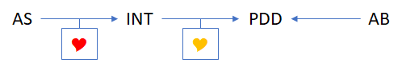

# ÂmeSensible
Le pauvre ou le nécessiteux, ou encore le miséreux, qu'est-ce qui les distingue? La richesse.
L'un est plus riche que l'autre, tous sont plus pauvre que le commun de la société.
Pire encore, leur avenir alimentaire est menacé. Un avenir plus ou moins proche.
Quoi de plus stressant et angoissant? Que fait-on lorsqu'on est sous cette menace?
Quoi penser lorsque le ou les prochains repas ne sont pas garantit? Quel est le sens de la vie si l'on meurt de faim?
Un déséquilibre entre ceux qui ont et ceux qui n'ont pas de quoi se nourrir, se vêtir, se loger, se réchauffer, se laver, se soigner, se protéger, s'éduquer...

Sans vouloir chercher les causes complexes, ÂmeSensible propose de réduire ce déséquilibre ne serait-ce qu'une seule fois pour chaque âme dans le besoin.
L'utilisateur est une âme charitable, sensible, aidant une âme dans le besoin.

## Dans quelle situation utiliser ÂmeSensible?
- Je vois une âme dans le besoin, je sollicite un réseau pour que quelqu'un s'en occupe
- J'ai du surplus à la maison (nourriture, vêtement, etc...) et je ne sais pas quoi en faire
- J'ai des compétences pouvant être utile à une âme dans le besoin
- J'ai seulement envie d'aider une âme dans le besoin

## Fonctionnement
### Abréviations
- AS = Âme Sensible, peut être un particulieur ou un profesionnel
- AB = Âme dans le Besoin, peut être n'importe qui à la condition d'être dans le besoin, non limité à une catégorie ou statut social particulier
- INT = Intermédiaire, peut être un particulier, une entreprise ou une association
- PDD = Point De Distribution (un établissement, un distributeur automatique, etc...)

### Scénarios simplifiés
|#|Cas|Description|
|-|-|-|
|1||AS rencontre AB et apporte son aide sous forme diverse (matérielle ou immatérielle): nourriture, vêtement, produit hygiénique, livre, médicament, couverture, etc...|
|2||INT se charge de distribuer à AB l'aide reçu d'un ou plusieurs AS|
|3||INT se charge de distribuer à AB l'aide reçu d'un ou plusieurs INT|
|4||AB visite un PDD pour recevoir de l'aide|

